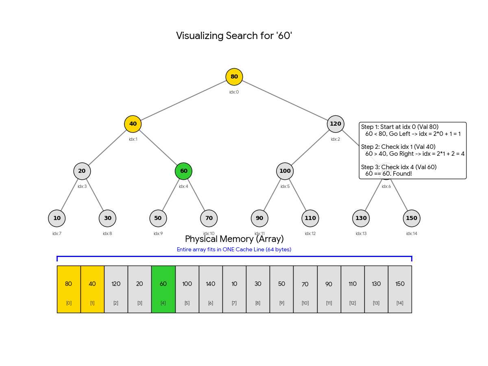

# Eytzinger Layout for Binary Search

> Credit to Nicholas for showing me this

[Eytzinger Layout](https://algorithmica.org/en/eytzinger) optimizes the memory access pattern of binary search by storing the sorted data in a Breadth-First Search (BFS) order. This is achieved via a balanced binary tree as shown:



Recall that a complete binary tree can be stored in an array where the children of the node at index k are located at indices `2k + 1` and `2k + 2`. Since the next midpoint is always a child node of the current midpoint, this layout offers significant spatial locality for top levels of the tree.

In the first few iterations, we often hit the same L1 CPU cache line (that was pulled) when the root node was retrieved. In contrast, a standard sorted array binary search makes massive jumps (e.g., from index `N/2` to `N/4`) immediately, causing cache misses at almost every step.

```Caveat
This is optimal for write-once, read-many workloads. Because the array is packed in a specific permuted order, inserting a new element is expensive (*O(N)*) as it often requires reconstructing the entire array
```


